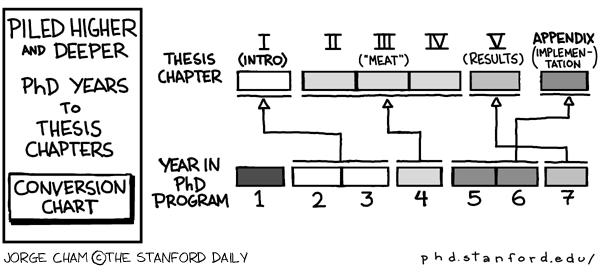

# "Emergent phenomena in driven, non-equilibrium systems: a computational and theoretical study"

Working materials for my PhD thesis.

Reminder: I should frame my thesis as problem-based, not technique-based.
I want to show that I could use multiple different techniques to solve a specific problem.
In this thesis, the problem I'm looking to solve is that of explaining the emergent behavior we see in types of active matter systems.

Links to helpful sites:
* [Dissertation handbook](https://rackham.umich.edu/wp-content/uploads/2019/09/oard-dissertation-handbook.pdf)
